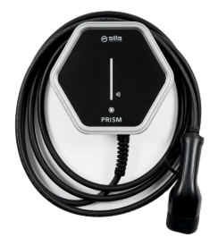
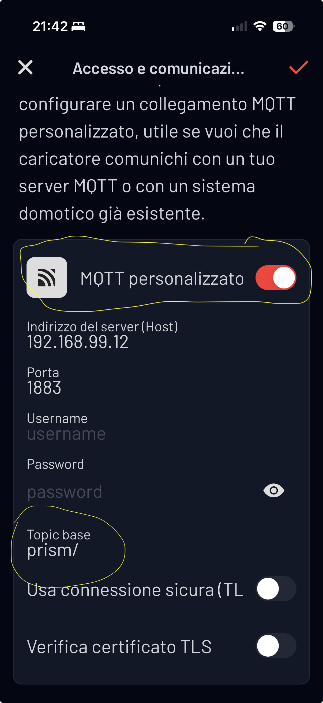
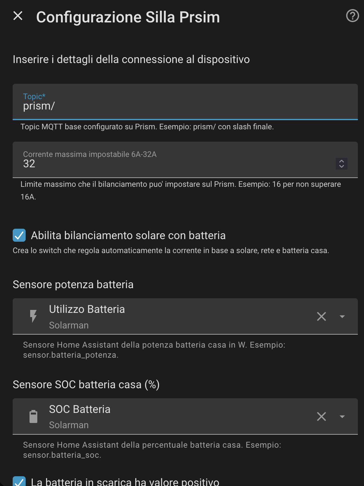
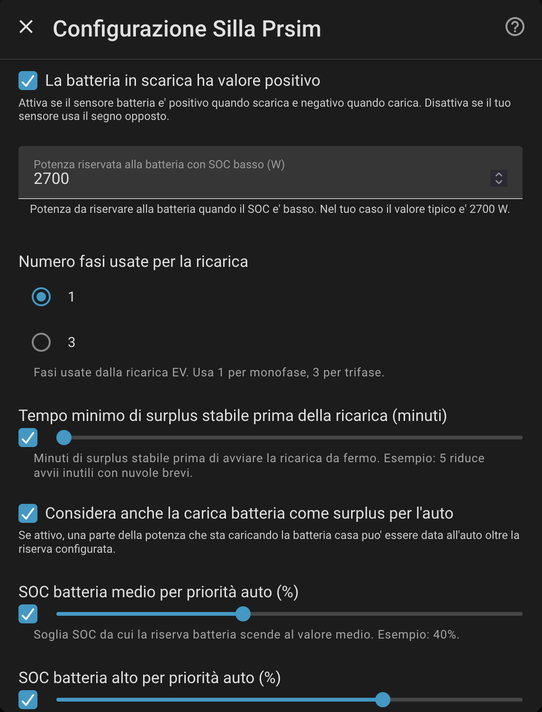
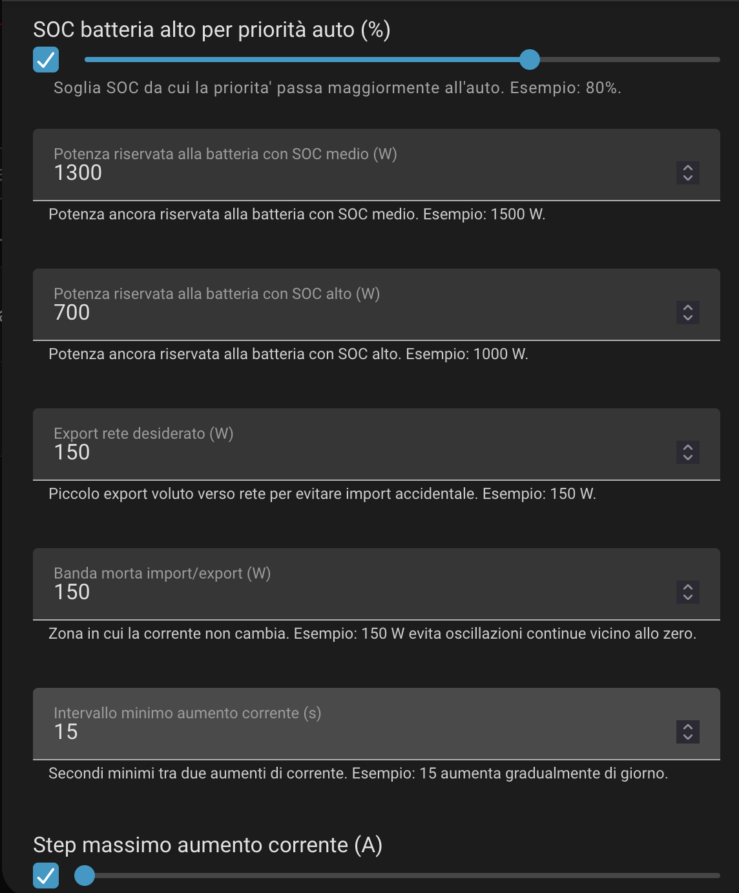
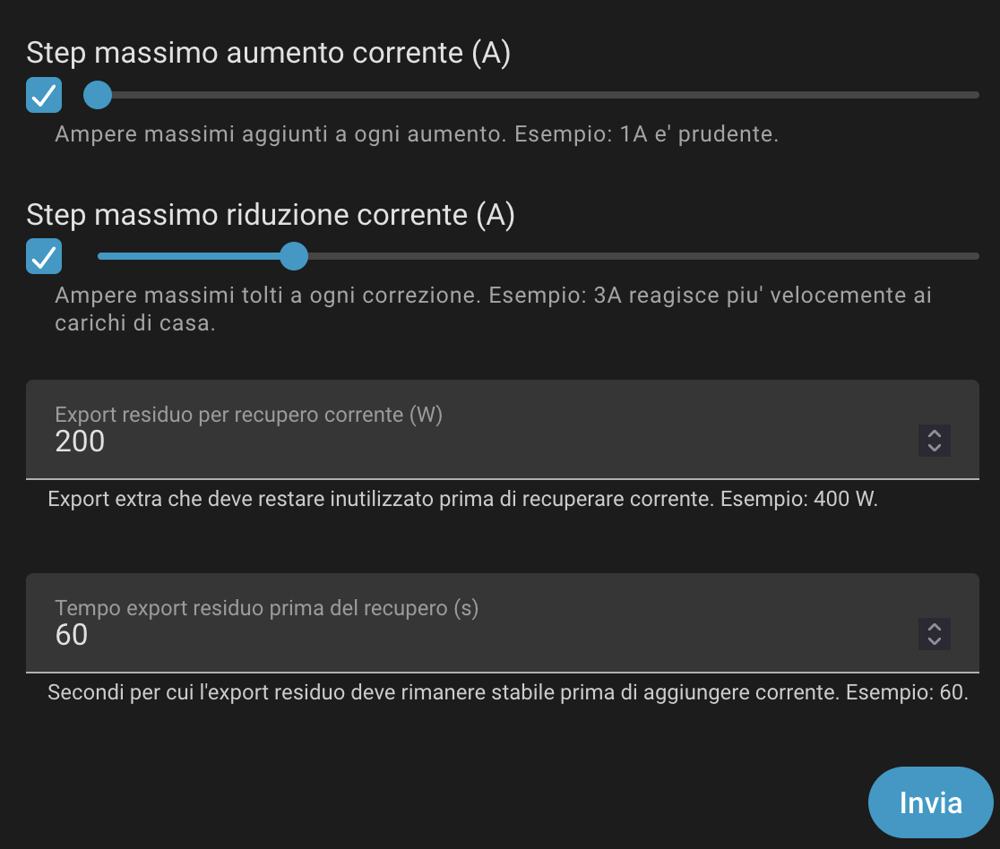
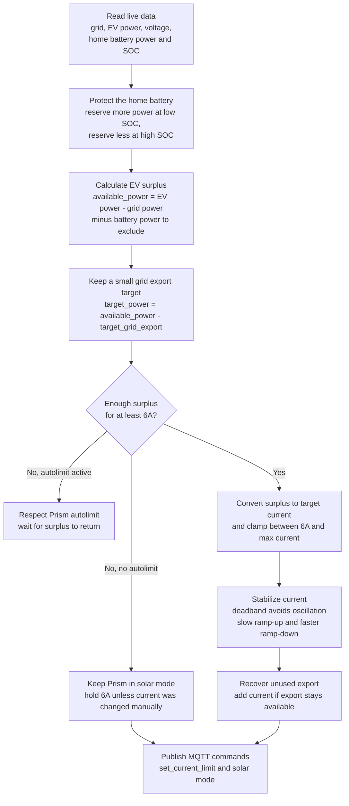
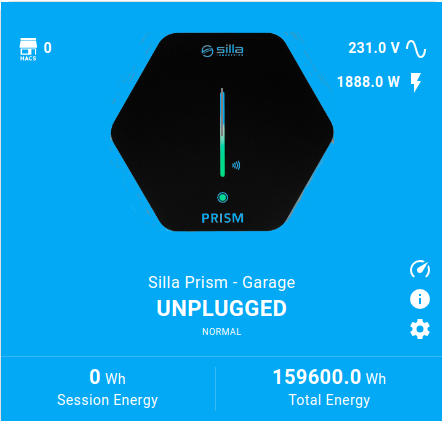

# Silla Prism Solar custom integration



This repository contains a custom integration to integrate a Silla Prism EVSE
inside Home Assistant.

## Fork status

This project is a fork of
[persuader72/silla-prism-integration](https://github.com/persuader72/silla-prism-integration).
The original project provides the base Silla Prism MQTT integration; this fork
adds experimental solar and home-battery charging logic.

> **Beta notice:** this fork is still in beta. The solar balancing features can
> actively change the current limit and operating mode of the EVSE through MQTT.
> Test carefully with conservative limits before relying on it unattended.

## New features in this fork

- Solar battery balancing switch per Prism charging port.
- Dynamic EV current control from Prism MQTT data, grid import/export, EV output
  power, port voltage and a Home Assistant home-battery power sensor.
- Optional home-battery SOC sensor selected directly from Home Assistant.
- Entity selectors for both the home-battery power sensor and SOC sensor, so the
  configuration no longer requires manually typing entity IDs.
- Configurable single-phase or three-phase surplus calculation.
- Configurable target grid export, import/export deadband and stable-surplus
  start delay to avoid chasing noisy measurements.
- Slow current ramp-up and fast ramp-down to reduce unwanted grid imports.
- Residual export recovery, which increases current by 1A after stable unused
  export remains available.
- Proportional current correction, so large sustained export can increase
  current faster while real import can reduce it faster.
- Automatic home-battery priority based on SOC:
  - low SOC reserves the configured battery charge power for the home battery;
  - medium SOC reserves a smaller configurable amount;
  - high SOC reserves an even smaller configurable amount;
  - SOC >= 95% gives priority to the EV.
- In solar mode, temporary low surplus no longer pauses the port; the
  controller keeps the EVSE in solar mode at 6A and raises current again when
  surplus returns. If the current limit was changed manually, that manual limit
  is preserved while low surplus remains. If Prism enters autolimit because of
  house-load protection, the controller does not force it back to solar until
  enough surplus is available again.
- Diagnostic sensors for calculated surplus, target current, grid power,
  battery power used in the calculation and controller decision reason.

## Installation

Prerequisites: A working MQTT server.

1) Configure the Prism EVSE to work with your MQTT server as shown in the
   [Prism MQTT manual](https://support.silla.industries/wp-content/uploads/2023/09/DOC-Prism_MQTT_Manual-rel.2.0_rev.-20220105-EN.pdf).
2) Configure and enable the [MQTT integration](https://www.home-assistant.io/integrations/mqtt/) for Home Assistant.
3) Install this custom integration with HACS as a custom repository, or copy the
   `custom_components/silla_prism` directory into your Home Assistant
   `custom_components` directory.

## Usage

1. Add the Silla Prism integration from the Home Assistant dashboard.
   [](https://my.home-assistant.io/redirect/brand/?brand=silla_prism)

2. Keep note of base path for all Prism topics

   

3. **Topic**: set the base path for all Prism topics. It must match the value
   configured in Prism. Keep the trailing **/** at the end of the topic.

4. **Number of ports**: if you have more than one port, for example Prism Duo,
   set the matching number of ports. For a single-port Prism, keep the default
   value of `1`.

5. **Serial number** or **unique code**: if you have more than one Prism
   connected to Home Assistant, fill this with a unique value, such as the serial
   number. For a single Prism, this can stay blank.

6. **Enable virtual sensor**: enables additional sensors derived from the
   original Prism sensors, such as total energy imported from the grid.

7. Configure the integration options. The setup form now includes inline field
   descriptions and examples for the solar battery balancing options.

   

   The first part contains the MQTT topic, the maximum current limit, the switch
   that enables solar battery balancing, and the Home Assistant sensors used for
   home-battery power and SOC. Select the battery power sensor in W and, if
   available, the SOC sensor in %. Enable the battery sign option when your
   battery sensor is positive while discharging and negative while charging.

   

   The second part sets the low-SOC battery reserve, the number of EV charging
   phases, the stable surplus delay, and whether battery charging power can be
   treated as EV surplus. Use `1` for single-phase charging or `3` for
   three-phase charging. In solar mode, low surplus is held at 6A instead of
   pausing the port, so the delay only affects when current can rise above the
   minimum.

   

   The third part defines the SOC thresholds and the power still reserved for
   the home battery at medium and high SOC. It also sets the target grid export,
   the import/export deadband, and the minimum interval between current
   increases. These values decide how aggressively the controller gives direct
   solar production to the EV while avoiding unwanted grid import.

   

   The last part controls the current ramp steps and residual export recovery.
   The increase step limits how quickly current rises, the decrease step lets
   the controller react faster when house loads appear, and residual export
   recovery adds current again if export remains unused for the configured time.

## Solar battery balancing

The integration can optionally create a `Solar battery balancing` switch for each
charging port. When enabled, it reads the Prism grid power, the Prism output
power, the port voltage and a Home Assistant battery power sensor, then updates
the Prism current limit so the EV uses only the available solar surplus without
discharging the battery.

Configure it from the integration setup/reconfigure form:

| Option | Description |
| ------ | ----------- |
| Enable solar battery balancing | Creates the balancing switch. |
| Battery power sensor | Home Assistant entity that reports battery charge/discharge power in W. |
| Home battery SOC sensor | Optional Home Assistant entity that reports the home battery state of charge in %. |
| Battery discharge is a positive value | Enable this if the sensor is positive while the battery is discharging and negative while charging. Disable it if your sensor uses the opposite sign. |
| Maximum battery charge power | Battery charge power, in W, reserved for the home battery while SOC is low. Default is `2700`. |
| Number of charging phases | Use `1` for single phase or `3` for three phase charging. |
| Stable surplus delay | Minutes of continuous surplus required before the integration starts charging. The default is `5`. |
| Use battery charge as surplus | When enabled, battery charging power is also treated as available EV surplus. This gives the car priority over storing that solar energy first. |
| Medium home battery SOC | SOC threshold where the reserved battery charge power drops to the medium reserve. Default is `40`. |
| High home battery SOC | SOC threshold where the reserved battery charge power drops to the high reserve. Default is `80`. |
| Medium SOC battery reserve | Battery charge power, in W, reserved before sending the rest to the EV at medium SOC. Default is `1500`. |
| High SOC battery reserve | Battery charge power, in W, reserved before sending the rest to the EV at high SOC. Default is `1000`. |
| Target grid export | Watts to intentionally keep exported as a safety buffer. Default is `150`. |
| Import/export deadband | Watts around the target export where current is left unchanged. Default is `150`. |
| Minimum current increase interval | Minimum seconds between upward current steps. Default is `15`. |
| Maximum current increase step | Maximum amp increase per ramp step. Default is `1`. |
| Maximum current decrease step | Maximum amp decrease per correction. Default is `3`. |
| Residual export for current recovery | Extra export that must remain available before adding current beyond the rounded calculation. Default is `400`. |
| Residual export time before recovery | Seconds residual export must stay above threshold before recovery. Default is `60`. |

The controller uses this formula:

```text
available_power = ev_power - grid_power - battery_power_to_exclude
target_power = available_power - target_grid_export
```



With the default sign convention, battery discharge reduces the available EV
power, while battery charge is not counted as available power. This means the
car uses exported solar surplus instead of slowing down battery charging. If the
available power is below the minimum Type 2 current of 6A while solar balancing
is enabled, the port is kept in solar mode at 6A instead of being paused. If the
current limit was changed manually, the controller preserves that manual limit
while low surplus remains. If Prism reports autolimit mode, the controller
treats that as a wallbox protection state and waits instead of forcing solar
mode at 6A.
If `Use battery charge as surplus` is enabled, battery charging power is counted
too, but only for the part that exceeds the battery charge power currently
reserved for the home battery. Without a SOC sensor, the fixed reserve is the
configured maximum battery charge power. With a SOC sensor, the reserve is
dynamic: low SOC reserves the configured maximum charge power, medium SOC
reserves the medium value, high SOC reserves the high value, and SOC >= 95%
reserves `0 W` so the EV gets priority. This lets the car use direct solar
energy while still protecting the home battery when it is low. The EV current
follows the calculated surplus, clamped between the Type 2 minimum of 6A and the
configured maximum current.
The controller then applies a target export, a deadband, ramp limits and
residual export recovery. By default it tries to keep about `150 W` exported,
ignores changes within `150 W`, increases by at most `1A` every `15` seconds,
decreases by up to `3A` immediately, and adds `1A` if more than `400 W` remains
exported for `60` seconds.
Before raising current above the minimum from a low-surplus hold, the surplus
can be delayed by the configured ramp and stabilization settings. This helps
avoid short clouds or transient loads repeatedly changing the car current. If
surplus drops below the Type 2 minimum, the port is kept in solar mode at 6A
instead of being paused, unless Prism reports autolimit.

When enabled, the integration also exposes additional sensors for each port:

| Entity | Description |
| ------ | ----------- |
| Solar balance status | Shows whether balancing is disabled, waiting for data, waiting for stable surplus, holding at 6A for low surplus or charging from surplus. |
| Solar surplus current | Current in amps currently available from the calculated solar surplus. |
| Stable surplus countdown | Seconds remaining before the integration starts charging automatically. |
| Calculated total surplus | Total power available to the balancing algorithm. |
| Battery power used in calculation | Battery contribution used by the algorithm. Positive values reduce EV power, negative values increase available EV power. |
| Grid power used in calculation | Latest Prism grid power value used by the algorithm. |
| Calculated target current | Final current the algorithm wants to send to Prism after deadband, ramp and recovery limits. |
| Raw target current | Current calculated directly from surplus before stabilisation. |
| Battery reserve power | Home-battery charge power currently protected by the SOC logic. |
| Target export power | Configured export buffer used by the controller. |
| Unused export power | Export still available beyond the target export and deadband; this is the power the EV could still recover. |
| Residual export countdown | Seconds remaining before unused export can trigger a current recovery step. |
| Decision reason | The current reason for the controller decision. |

The solar balance diagnostic entities also expose extra attributes including
`battery_soc`, `battery_reserve_power`, `battery_charge_power`,
`battery_discharge_power`, `available_power`, `target_power`,
`raw_target_current`, `target_current`, `unused_export_power`,
`excess_import_power`, `deadband_active`, `ramp_limited`, `ramp_direction` and
`current_limit_reason`.

## Entities

| Entity ID                         | Type         | Description                                                  | Unit                                   |
| --------------------------------- | ------------ | ------------------------------------------------------------ | -------------------------------------- |
| silla_prism_online                | BinarySensor | Sensor to find if Prism is connected or not                  |                                        |
| silla_prism_current_state         | Sensor       | Current state of Prism                                       | "idle", "waiting", "charging", "pause" |
| silla_prism_power_grid_voltage    | Sensor       | Measured voltage from grid                                   | V                                      |
| silla_prism_output_power          | Sensor       | Power provided to the charging port                          | W                                      |
| silla_prism_output_current        | Sensor       | Current provided to the charging port                        | mA                                     |
| silla_prism_output_car_current    | Sensor       | Current driven by the car                                    | A                                      |
| silla_prism_current_set_by_user   | Sensor       | Current limit set by user                                    | A                                      |
| silla_prism_session_time          | Sensor       | Duration of the current session                              | s                                      |
| silla_prism_session_output_energy | Sensor       | Energy provided to the charging port during the current session | Wh                                     |
| silla_prism_total_output_energy   | Sensor       | Total energy                                                 | Wh                                     |
| silla_prism_error                 | BinarySensor | Error status (ON when there is an error)                     |                                        |
| silla_prism_current_port_mode     | Sensor       | Current port mode                                            | solar,normal,paused                    |
| silla_prism_input_grid_power      | Sensor       | Input power from grid                                        | W                                      |
| silla_prism_set_max_current       | Number       | Set the user current limit                                   | A                                      |
| silla_prism_set_current_limit     | Number       | Set the  current limit                                       | A                                      |
| silla_prism_set_mode              | Select       | Set current port mode                                        | solar,normal,paused                    |
| silla_prism_touch_sigle           | BinarySensor | Goes on for 1 second after a single touch gesture            | On,Off                                 |
| silla_prism_touch_double          | BinarySensor | Goes on for 1 second after a double touch gesture            | On,Off                                 |
| silla_prism_touch_long            | BinarySensor | Goes on for 1 second after a long touch gesture              | On,Off                                 |

## Computed Entities

Computed entities are not directly measured from Prism but are derived from other measurements. 

| Entity ID                     | Type   | Description                  | Unit |
| ----------------------------- | ------ | ---------------------------- | ---- |
| silla_prism_input_grid_energy | Sensor | Total energy taken from grid | Wh   |
|                               |        |                              |      |
|                               |        |                              |      |


# Setting up the user interface

## With the charger card integration



It's possible to configure the [EV Charger Card](https://github.com/tmjo/charger-card) using the configuration example [provided](https://github.com/persuader72/custom-components/blob/main/charger-card/template.yaml) in this repository 

## With automations and helpers

The following four examples show how to set up a simple interface
via Home Assistant helpers (input booleans) and automations.  You do
not have to use all four!

These automations and input booleans can also be used with the
EV Charger Card, though they are most useful without it.

### Start/stop charge with a switch

For now, disable Autostart on the Prism (later I will show how to keep
it enabled).

Create an "Input Boolean" called `prism_charge` (suggested icon:
`mdi:ev-plug-type2`).  The following automation starts and stop the
charging process when `prism_charge` is toggled:

```yaml
alias: Prism - authorize/deauthorize
triggers:
  - trigger: state
    entity_id:
      - input_boolean.prism_charge
    id: changed_switch
  - trigger: state
    entity_id:
      - sensor.silla_prism_current_state
    id: changed_state
actions:
  - if:
      - condition: state
        entity_id: sensor.silla_prism_current_state
        state: idle
    then:
      - action: input_boolean.turn_off
        target:
          entity_id: input_boolean.prism_charge
      - stop: No charging cable connected
  - condition: trigger
    id:
      - changed_switch
  - if:
      - condition: state
        entity_id: input_boolean.prism_charge
        state: 'on'
    then:
      - action: button.press
        target:
          entity_id: button.silla_prism_set_mode_traps_auth
    else:
      - action: button.press
        target:
          entity_id: button.silla_prism_set_mode_traps_noauth
mode: single
```

### Start/stop charge with a single touch on the Prism

With the previous set up, Autostart is disabled, but starting/stopping
the charge process with the Prism key fobs does not synchronize with
the Input Boolean.

Instead of using the key fobs, you can configure another automation that
toggles the Input Boolean with a single touch on the Prism's sensor:

```yaml
alias: Prism - toggle charge after single touch event
description: ""
triggers:
  - trigger: state
    entity_id:
      - binary_sensor.silla_prism_touch_sigle
    to: on
actions:
  - action: input_boolean.toggle
    target:
      entity_id: input_boolean.prism_charge
mode: single
```

### Same setup but with Autostart enabled

If you prefer to keep Autostart enabled or to use the key fobs, just ensure
`prism_charge` changes to on and off when `sensor.silla_prism_current_state`
becomes respectively `charging` or anything else:

```yaml
alias: Prism - synchronize charging state
description: ""
triggers:
  - trigger: state
    entity_id:
      - sensor.silla_prism_current_state
    id: changed_prism
actions:
  - if:
      - condition: state
        entity_id: sensor.silla_prism_current_state
        state: charging
    then:
      - action: input_boolean.turn_on
        target:
          entity_id: input_boolean.prism_charge
  - else:
      - action: input_boolean.turn_off
        target:
          entity_id: input_boolean.prism_charge
mode: single
```

This can be used with any combination of the previous automations.

### Switch normal/solar modes from Home Assistant

Create an "Input Boolean" called `prism_solar_mode` (suggested icon:
`mdi:weather-sunny`).  The following automation keeps it synchronized
with the "solar" and "normal" modes of the Prism dashboard:

```yaml
alias: Prism - synchronize solar/normal mode
description: ""
triggers:
  - trigger: state
    entity_id:
      - input_boolean.prism_solar_mode
    id: changed_helper
  - trigger: state
    entity_id:
      - sensor.silla_prism_current_port_mode
    id: changed_prism
actions:
  - if:
      - condition: trigger
        id:
          - changed_helper
    then:
      - if:
          - condition: state
            entity_id: input_boolean.prism_solar_mode
            state: on
        then:
          - action: select.select_option
            data:
              option: solar
            target:
              entity_id: select.silla_prism_set_mode
        else:
          - action: select.select_option
            data:
              option: normal
            target:
              entity_id: select.silla_prism_set_mode
    else:
      - if:
          - condition: state
            entity_id: sensor.silla_prism_current_port_mode
            state: solar
        then:
          - action: input_boolean.turn_on
            target:
              entity_id: input_boolean.prism_solar_mode
      - if:
          - condition: state
            entity_id: sensor.silla_prism_current_port_mode
            state: normal
        then:
          - action: input_boolean.turn_off
            target:
              entity_id: input_boolean.prism_solar_mode
mode: single
```
