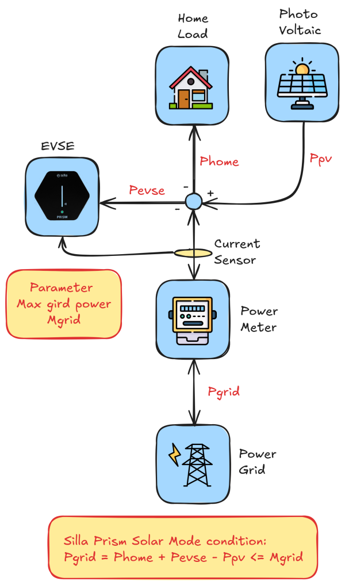

# Solar charging algorithm

| Powers | Descrition                                                   |
| ------ | ------------------------------------------------------------ |
| Phome  | Is the power absorbed by the Home. Is always positive.       |
| Ppv    | Is the power produced by the photovoltaic system is alwais negative |
| Pevse  | Is teh power absorbed by the car us alwais positive          |
| Pgrid  | Is tbe power absorbed or produced by the home. Can be positive is the is home loads (with evse) is greater than the photovoltaic production. Is negative in the  photovoltaic production is greater than the home loads (with evse). |
| Mgrid  | Is a fixed parameter that tell the EVSE to interrupt charging if Pgid is greater than Mgrid. If you are consuming more that Mgrid. |

The following image show the schematic of the system take in account.

To compute how much power the Evse will provide to the car we can use the following formula **Pevse = Ppv + Mgrid - Phome** with the condition that Pevse is greater than 1320W in a single phase system or 3900W in a triphase system. If Home Assistant solar production and house load sensors are configured, the integration uses those external sensors as the EV surplus source: external solar production minus external house load. Optional battery charge power can increase the available EV surplus only when solar production already exceeds house load. When this option is enabled, the configured battery reserve is also used as an approximate maximum battery charge target: if the battery keeps charging above that target, EV current can rise gradually while avoiding excessive grid import. The house load sensor should preferably exclude the EV charger; if it includes it, create a template sensor that subtracts Prism EV output power. Prism `energy_data/power_solar` and `energy_data/power_house` are not used for this direct calculation because on some installations they stay at `0`. Without both external sensors, the integration falls back to estimating surplus from EV power, grid import/export and battery power. Because a Type2 connector can't charge below than **6A**, which is **1.3Kw** using a single phase and **3.9Kwh** using three phase, the integration keeps the port in solar mode at 6A when the calculated solar surplus is lower than the minimum. Persistent residual export can still raise current from that 6A hold, so stable exported power is recovered into the car instead of being sold to the grid. If the current limit was changed manually, the integration preserves that manual limit while low surplus remains. If Prism reports autolimit mode, the integration respects that wallbox protection state while grid import is above the configured deadband. When the load drops and grid import returns inside the deadband, the integration makes one 6A recovery attempt and then waits 5 minutes before trying again. If Prism reports paused mode or pause state, for example because a charge limit was reached in the wallbox/app, the integration respects that pause and does not resume charging automatically.

| Phome | Ppv   | Pevse      | Pgrid |
| ----- | ----- | ---------- | ----- |
| 200W  | 800W  | 1320W (6A) | 800W  |
| 200W  | 1050W | 1320W (6A) | 470W  |
| 200W  | 1320W |            |       |
