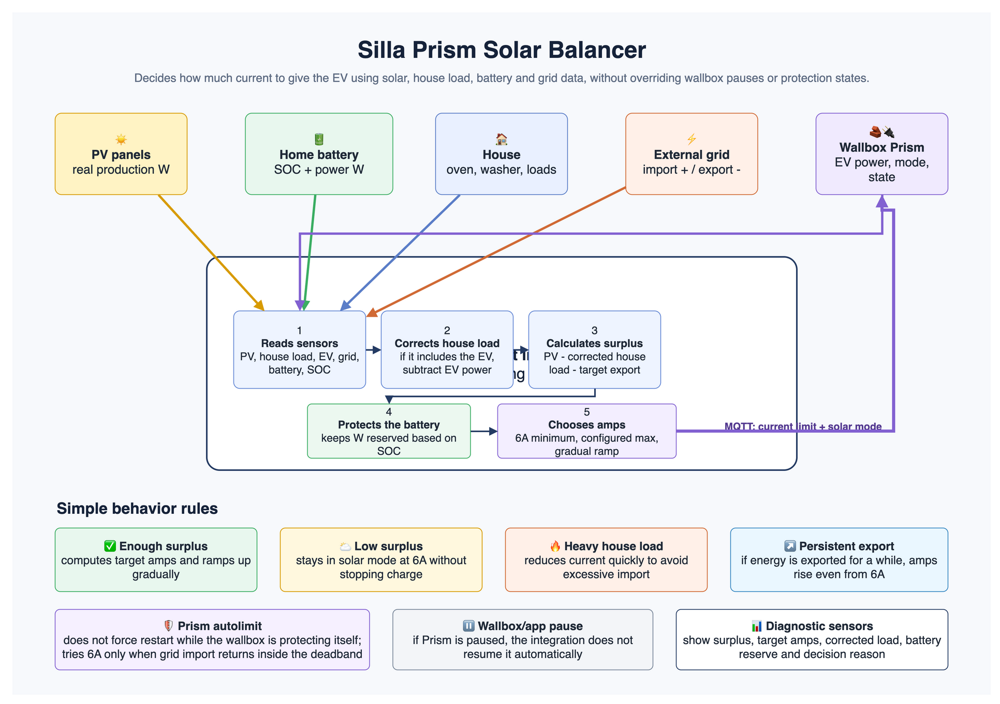

# Solar charging algorithm

This page describes the solar battery balancing logic used by the Silla Prism
integration.

The controller tries to send only usable solar surplus to the EV, while keeping
a configurable safety buffer for the home battery and avoiding unwanted grid
import. It writes Prism MQTT commands for current limit and solar mode, but it
does not override wallbox pauses or autolimit protection.



The editable draw.io source is available at
[`images/solar-balancer-overview.drawio`](images/solar-balancer-overview.drawio).

## Inputs

| Signal | Source | Meaning |
| ------ | ------ | ------- |
| Solar production | Configured Home Assistant sensor | Real PV production in W. Prism `energy_data/power_solar` is not used for balancing because it can stay at `0`. |
| Home load | Configured Home Assistant sensor | House load in W. If this total also includes the EV charger, enable the matching option so EV power is subtracted first. |
| EV power | Prism MQTT | Current power delivered to the car. |
| Grid power | Prism MQTT | Positive means import, negative means export. |
| Battery power | Configured Home Assistant sensor | Home battery power in W, normalized by the configured sign option. Positive means discharge, negative means charge. |
| Battery SOC | Configured Home Assistant sensor | Optional SOC used to choose the battery reserve target. |
| Port mode/state | Prism MQTT | Used to respect autolimit and external pauses. |

## Direct Surplus Formula

When solar production and home load sensors are configured, the preferred
formula is:

```text
effective_home_load = home_load
if home_load_includes_ev:
    effective_home_load = max(home_load - ev_power, 0)

available_power = solar_production - effective_home_load

if use_battery_charge and available_power > 0:
    available_power += max(battery_charge_power - battery_reserve_power, 0)

target_power = available_power - target_grid_export
```

If the external sensors are not available, the fallback estimator is:

```text
available_power = ev_power - grid_power - battery_power_to_exclude
target_power = available_power - target_grid_export
```

## Battery Reserve

The battery reserve is the amount of battery charging power the controller tries
to leave for the home battery before giving the rest to the EV.

With a SOC sensor:

| Battery SOC | Reserve used |
| ----------- | ------------ |
| Below medium SOC | Maximum battery charge power |
| At or above medium SOC | Medium SOC battery reserve |
| At or above high SOC | High SOC battery reserve |
| At or above 95% | `0 W` |

When `Use battery charge as surplus` is enabled, the reserve is also treated as
an approximate maximum battery charge target. If the battery is still charging
above that target, EV current can rise gradually to bring battery charging back
toward it. The result is approximate because Prism current changes in whole amps.

## Current Selection

The controller converts target power into amps using the configured phase count:

```text
watts_per_amp = grid_voltage * phases
target_current = floor(target_power / watts_per_amp)
```

The current is clamped between the Type 2 minimum of `6A` and the configured
maximum current.

If target power is below the Type 2 minimum, the integration keeps Prism in
solar mode at `6A` instead of pausing. If there is persistent real grid export,
residual export recovery can still raise current above `6A` after the configured
delay.

## Stabilization

To avoid command loops and oscillation, the controller applies:

| Mechanism | Purpose |
| --------- | ------- |
| Target export | Keeps a small export buffer before giving power to the EV. |
| Deadband | Leaves current unchanged near the target export. |
| Stable surplus delay | Waits before starting or raising from an idle/low-surplus state. |
| Increase interval and step | Raises current gradually. |
| Decrease step | Drops current faster when house loads appear. |
| Residual export recovery | Adds current when export remains unused for long enough. |

## Wallbox Protection States

Autolimit and pause are intentionally handled differently.

If Prism reports autolimit, the integration treats it as a wallbox protection
state. It does not force solar mode while grid import is above the deadband.
When import returns inside the deadband, it makes one `6A` recovery attempt and
then waits 5 minutes before trying again.

If Prism reports paused mode or pause state, the integration treats it as a
deliberate wallbox/app pause, for example a charge limit reached. It does not
resume charging automatically.

## Diagnostic Sensors

The integration exposes diagnostic sensors for the latest decision, including
calculated surplus, target current, raw target current, grid power, solar
production, corrected home load, battery reserve, unused export and decision
reason. These sensors are the best way to understand why the controller is
holding, raising or lowering current.
